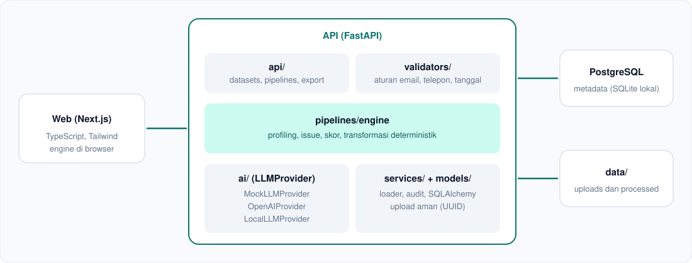

<p align="center">
  
  
  
  
  
  
  
  
</p>

<p align="center">
  Platform AI Engineer yang mengubah spreadsheet berantakan menjadi dataset bersih, tervalidasi, terdokumentasi, dan siap dipakai untuk analisis maupun machine learning.
</p>

##  Overview

CSV2Trust membaca file CSV atau Excel, mendeteksi masalah kualitas data, merekomendasikan transformasi, menjalankannya secara deterministik, lalu menghasilkan **pipeline yang bisa dijalankan ulang** beserta laporan kualitas.

Contoh masalah yang ditangani:

| Sebelum | Sesudah |
|---|---|
| `Rp 100.000`, `Rp.120.000`, `120000.00` | `100000`, `120000` |
| `01/09/26`, `2026/09/02`, `09-01-2026` | `2026-09-01`, `2026-09-02` |
| `0812 2222 3333`, `+62 813-5555-1212` | `+6281222223333`, `+6281355551212` |
| `ANDI@GMAIL.COM`, `budi santoso` | `andi@gmail.com`, `Budi Santoso` |
| `-`, `N/A`, nilai umur kosong | sel kosong, lalu median imputation |
| Baris yang sama dengan format berbeda | satu baris (duplikat dihapus) |

##  Fitur

| | Fitur | Keterangan |
|---|---|---|
|  | Upload | CSV, XLSX, XLS sampai 150 MB, dengan validasi format, file kosong, dan file rusak |
|  | Profiling | Tipe semantik kolom, null %, unique, duplikat, min, max, mean, median, std |
|  | Deteksi masalah | Email invalid, format tanggal, telepon, currency, missing, duplikat, outlier IQR, Isolation Forest |
|  | Lapisan AI | Provider modular dengan fallback rule-based, LLM tidak pernah mengubah data |
|  | Cleaning Studio | Pilih rekomendasi, preview langsung, terapkan |
|  | Pipeline Builder | Urutkan, nonaktifkan, duplikat, hapus langkah, ekspor JSON atau Python |
|  | Skor kualitas | 0 sampai 100 dari completeness, validity, consistency, uniqueness, dihitung dari data nyata |
|  | Export | CSV, XLSX, Parquet, JSON, pipeline, schema, laporan kualitas |
|  | Keamanan | Validasi tipe dan ukuran file, nama file di disk berupa UUID, CORS, rate limiting |

##  Arsitektur

<p align="center"></p>

##  Quick Start

Butuh Node 18.17+ dan Python 3.12+.

### Frontend

```bash
cd apps/web
npm install
npm run dev
```

Buka http://localhost:3000, lalu klik **Start Cleaning Data**. Frontend saat ini memproses file langsung di browser.

### Backend

```bash
cd apps/api
python3 -m venv .venv
source .venv/bin/activate
pip install -r requirements.txt
uvicorn app.main:app --reload
```

Dokumentasi interaktif: http://localhost:8000/docs. Tanpa `DATABASE_URL`, API memakai SQLite di folder `data/`, jadi PostgreSQL tidak wajib untuk uji lokal.

Coba alur lengkap lewat terminal:

```bash
curl -F "file=@data/samples/messy_customers.csv" http://localhost:8000/api/datasets/upload
# salin "id" dari respons, lalu:
curl -X POST http://localhost:8000/api/datasets/ID/clean
curl -X POST http://localhost:8000/api/datasets/ID/validate
curl -o clean.csv http://localhost:8000/api/export/ID/csv
curl -o pipeline.py "http://localhost:8000/api/export/ID/pipeline?format=python"
```

### Docker (PostgreSQL dan API)

```bash
cp .env.example .env
docker compose up --build
```

API tersedia di http://localhost:8000. Frontend dijalankan terpisah dengan `npm run dev`.

##  Environment Variables

| Variabel | Fungsi | Default |
|---|---|---|
| `DATABASE_URL` | Koneksi database | SQLite lokal |
| `LLM_PROVIDER` | `mock`, `openai`, atau `local` | `mock` |
| `OPENAI_API_KEY` | Kunci API OpenAI (opsional) | kosong |
| `LOCAL_LLM_URL` | Server LLM lokal kompatibel OpenAI | `http://localhost:11434/v1` |
| `MAX_UPLOAD_SIZE_MB` | Batas ukuran upload | `150` |
| `NEXT_PUBLIC_API_URL` | Alamat API untuk frontend | `http://localhost:8000` |

##  API

| Method | Endpoint | Fungsi |
|---|---|---|
| POST | `/api/datasets/upload` | Upload dan analisis otomatis |
| GET | `/api/datasets`, `/api/datasets/{id}` | Daftar dan detail dataset |
| GET | `/api/datasets/{id}/profile` | Profil kolom dan statistik |
| GET | `/api/datasets/{id}/issues` | Masalah kualitas dan langkah yang direkomendasikan |
| POST | `/api/datasets/{id}/analyze` | Analisis ulang plus interpretasi AI |
| POST | `/api/datasets/{id}/clean` | Terapkan transformasi dan buat pipeline |
| POST | `/api/datasets/{id}/validate` | Hasil PASS, WARNING, FAIL per kolom |
| GET | `/api/datasets/{id}/preview` | Pratinjau data mentah atau bersih |
| GET | `/api/datasets/{id}/quality` | Skor sebelum dan sesudah |
| POST, GET | `/api/pipelines` | Buat dan daftar pipeline |
| GET, DELETE | `/api/pipelines/{id}` | Detail dan hapus pipeline |
| POST | `/api/pipelines/{id}/run` | Jalankan ulang pada dataset lain yang kompatibel |
| GET | `/api/export/{id}/{csv,xlsx,parquet,pipeline,report}` | Unduh hasil |

##  Arsitektur AI

```
LLMProvider
├── MockLLMProvider     rule-based, tanpa jaringan (default dan fallback)
├── OpenAIProvider      JSON terstruktur, divalidasi Pydantic
└── LocalLLMProvider    Ollama, LM Studio, vLLM
```

Aturan utamanya: **LLM tidak pernah menerima atau mengubah seluruh dataset.** Provider hanya menerima nama kolom, beberapa sampel nilai, dan ringkasan masalah, lalu mengembalikan interpretasi skema dan rekomendasi dalam JSON. Jika provider gagal atau mengembalikan format yang salah, sistem otomatis memakai MockLLMProvider. Semua transformasi tetap dijalankan oleh engine Python yang deterministik.

##  Pipeline

Setiap pipeline disimpan sebagai JSON dan bisa dijalankan ulang pada dataset lain dengan skema yang kompatibel:

```json
{
  "pipeline_name": "customers_cleaning",
  "version": "1.0.0",
  "steps": [
    { "operation": "standardize_missing", "column": "*" },
    { "operation": "normalize_email", "column": "Email" },
    { "operation": "parse_date", "column": "Purchase Date" },
    { "operation": "convert_currency", "column": "Revenue" },
    { "operation": "remove_duplicates", "column": "*" }
  ]
}
```

Ekspor Python menghasilkan script mandiri yang memakai fungsi engine yang sama, jadi hasilnya identik:

```bash
python pipeline.py input.csv output.csv
```

##  Testing

```bash
cd apps/api
python3 -m pytest -q
```

Tes mencakup alur upload, profiling, deteksi masalah, cleaning, validasi, ekspor (CSV, XLSX, Parquet, pipeline, laporan), menjalankan ulang pipeline, serta penanganan file tidak valid.
